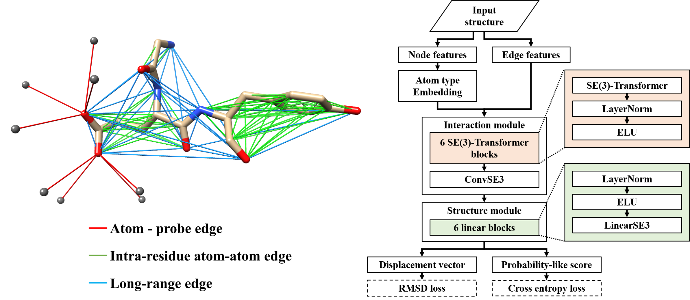

# WatGNN
Water position prediction method with SE(3)-Graph Neural Network



WatGNN predicts water positions around proteins and protein–compound complexes. This method places four probe points near each eligible noncarbon atom, then uses an SE(3)-equivariant graph neural network to score possible water sites and predict three-dimensional shifts from those probe points. The shifted positions are filtered by score, and predictions might have steric clash with input atoms or another duplicate predictions are removed.


## Installation (Uses Anaconda)

### For Linux/NVIDIA (Recommended)
Due to DGL's supported python and pytorch version issue, this method will install Python 3.12, PyTorch 2.4.0, and cuda 12.1.

This method was tested on Ubuntu 22.09 with Intel i9-12900k CPU and NVIDIA RTX 4090.

```bash
conda env create -f environment.yml -n watgnn
conda activate watgnn
python -m pip install -e .

#module import test
conda list mkl
python -c "import torch, dgl; print(torch.__version__, torch.version.cuda, dgl.__version__)"
```

### For Windows/NVIDIA
Please install [Windows Subsystem for Linux](https://learn.microsoft.com/en-us/windows/wsl/install) (WSL) on windows and follow Linux/NVIDIA Installation method.

### For MacOS (Will be installed, but not recommended)
WARNING: Following installation will use CPU for the prediction.

This method will install Python 3.11 and PyTorch 2.1.1.

Tested on MacBook Air 2020 (Apple M1 + 16GB DRAM)

```bash
#use MacOS version of pyproject.toml instead of default toml file.
mv pyproject_macos.toml pyproject.toml

conda env create -f environment_macos.yml
conda activate watgnn-macos

python -m pip install "numpy==1.26.4" "torch==2.1.1" "torchdata==0.7.1" "dgl==2.2.0"
python -m pip install -e .

#module import test
python -c "import torch, torchdata.datapipes.iter, dgl; print(torch.__version__, dgl.__version__)"
```

## Usages
Go to watgnn directory where watgnn.py exists and,
```bash
usage: watgnn.py [dataset file path] 

example 1): watgnn.py single_protein_example.txt
example 2): watgnn.py protein_compound_example.txt
```

### dataset file structure
for each line:
[Input PDB/CIF file path] [Input mol2 file path(optional, for protein-compound complex)]

example:

1) single_protein_example.txt:
```bash
./single_protein_structures/1byi_A.pdb
```

2) protein_compound_example.txt
```bash
./protein_compound_structures/1d2e_protein.pdb ./protein_compound_structures/1d2e_ligand.mol2
```

## Config file (watgnn/watgnn_config.py) for prediction
'score_cutoff' (default: 0.65, [0,1]) : sets score cutoff of each predicted site

'clust_radius' (default: 2.0 (angstrom) ) : sets prediction exclusion radius from input atoms and other predicted water sites.

## Predicted water sites
The predicted water sites will be saved as ./gnn_result/[input protein file name]_pred.pdb, with PDB file format.

The B-factor column will have 100 * predicted score.

## Dataset used in the preprint
Now the dataset and precalculated data is located at the differet Repository, [https://github.com/shadow1229/WatGNN_SI/](https://github.com/shadow1229/WatGNN_SI/)

Dataset: [check here](https://github.com/shadow1229/WatGNN_SI/tree/main/Dataset)

Precalculated data: [check here](https://github.com/shadow1229/WatGNN_SI/tree/main/Precalculated_data)

## Reference
Sangwoo Park, "Water position prediction with SE(3)-Graph Neural Network", _bioRxiv_ (**2024**). [Link](https://www.biorxiv.org/content/10.1101/2024.03.25.586555v1)


